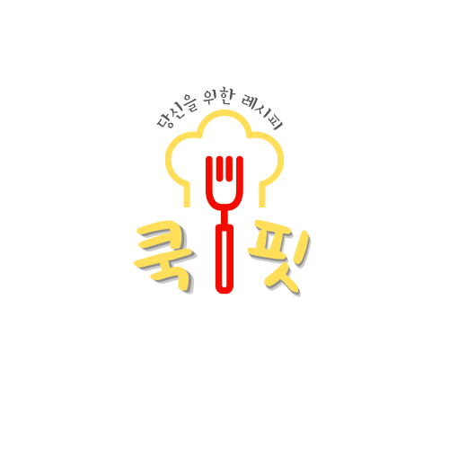

# 👩‍🍳당신을 위한 레시피  "쿡핏 : COOK FIT"

## 프로젝트 소개

쿡핏: COOK FIT은 사용자가 입력한 재료를 기반으로 적합한 메뉴를 추천하고, 레시피까지 자동으로 생성해 주는 맞춤형 레시피 플랫폼입니다.
이 서비스는 레시피 히스토리 관리와 즐겨찾기 저장 기능을 통해 사용자의 취향과 요리를 효율적으로 관리할 수 있도록 설계되었습니다.
최적화된 추천 알고리즘과 직관적인 사용자 경험을 바탕으로, 간편하면서도 개인화된 요리 여정을 제공합니다.

## ✨ 기능
✅ ChatGPT-API를 사용한 사용자 맞춤형 레시피 추천  
✅ 레시피 저장  
✅ 데이터 분석 기반 재료 기반 메뉴 추천 알고리즘

## 👥Runner Team3
<table border="1">
  <tr>
    <th>이름</th>
    <th>역할</th>
    <th>담당 업무</th>
  </tr>
  <tr>
    <td>박민서</td>
    <td>BackEnd</td>
    <td>로그인, 로그아웃, 이미지 검색</td>
  </tr>
  <tr>
    <td>박인애</td>
    <td>FrontEnd</td>
    <td>프론트엔드 개발</td>
  </tr>
  <tr>
    <td>유혜진</td>
    <td>BackEnd</td>
    <td>레시피 생성 및 저장, 히스토리 관리</td>
  </tr>
  <tr>
    <td>이다빈</td>
    <td>DataAnalysis</td>
    <td>데이터 분석 및 백엔드 연결</td>
  </tr>
  <tr>
    <td>홍연재</td>
    <td>DataAnalysis</td>
    <td>추천 알고리즘 구현</td>
  </tr>
</table>

## 🛠️Teck Stack
- 개발 기간 : 2024.12.21 ~ 2024.12.23

- stack   

