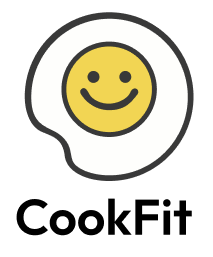

# 👩‍🍳당신을 위한 레시피  "쿡핏 : COOK FIT"

## 💡 프로젝트 소개

COOK FIT은 사용자가 입력한 재료를 분석하여 최적의 메뉴를 추천하고, 웹 크롤링 및 LLM 정제를 통해 구조화된 레시피 정보를 제공하는 맞춤형 레시피 플랫폼입니다.
개인 맞춤형 요리 경험을 제공하는 COOK FIT과 함께 더 스마트한 요리 생활을 즐겨보세요!🍽️

 

## ✨ 기능
✅ 카카오 로그인 API를 활용한 간편 로그인  
✅ 사용자가 입력한 재료를 BM25 알고리즘을 활용하여 검색하고, 가장 유사한 상위 3개 레시피를 추천  
✅ 추천된 메뉴의 레시피를 웹 크롤링 및 LLM(Gemma2-9B-IT) 정제를 통해 구조화된 정보로 제공  

 

## 🏆 결과
코드잇 이화 러너톤 '1등' 

 

## 👥Runner Team3
<table border="1">
  <tr>
    <th>이름</th>
    <th>역할</th>
    <th>담당 업무</th>
  </tr>
  <tr>
    <td>박민서</td>
    <td>기획, BackEnd</td>
    <td>로그인, 로그아웃, 이미지 검색</td>
  </tr>
  <tr>
    <td>박인애</td>
    <td>기획, FrontEnd</td>
    <td>프론트엔드 개발</td>
  </tr>
  <tr>
    <td>유혜진</td>
    <td>기획, BackEnd, AI</td>
    <td>메뉴 추천 및 레시피 제공 기능</td>
  </tr>
  <tr>
    <td>이다빈</td>
    <td>기획, DataAnalysis</td>
    <td>데이터 수집</td>
  </tr>
  <tr>
    <td>홍연재</td>
    <td>기획, DataAnalysis</td>
    <td>데이터 수집</td>
  </tr>
  <tr>
    <td>박도혜</td>
    <td>디자이너</td>
    <td>UI/UX</td></td>
  </tr>
</table>

 

## 🛠️Teck Stack
- 개발 기간 : 2024.12 ~ 2024.3

- stack   

